# General Purpose JAX Controller

**Language:** Python 3 (JAX)

## Project Overview

This project implements a general-purpose control system framework capable of regulating various simulated environments ("Plants") using both classical and AI-driven control strategies.

The core of the system is built on **JAX**, utilizing its automatic differentiation capabilities to optimize controller parameters via Gradient Descent. By tracing the execution path through the simulation loop using `jax.lax.scan`, the system can compute gradients for the entire episode history, enabling efficient learning for both PID parameters and Neural Network weights.

## Design Philosophy: "The Critical Divide"

Strict adherence to the **Separation of Concerns** principle is central to this implementation. The system is architected to maintain a clean boundary between the **AI/Controller** and the **Simulated World (Plant)**.

* **The Controller** acts as a general-purpose agent. It perceives an *error* signal and outputs a *control signal* (U), without inherent knowledge of the physical laws governing the plant.
* **The Plant** encapsulates the domain logic, physics, and state transitions. It exposes a standardized interface (`update`, `reset`, `get_target`) but remains passive regarding control logic.
* **CONSYS** serves as the integration layer, managing the feedback loop and facilitating data flow between the two components.

## The Controllers

This project implements and compares two distinct control architectures. The **Classic PID Controller**, illustrated in Figure 1, functions by mapping the current error signal $e(t)$, its integral, and its derivative to a control output $u(t)$. This linear mapping relies on three discrete gain parameters—$k_p$, $k_i$, and $k_d$—which serve as the sole variables for tuning the system response. In contrast, the **Neural Network Controller** (Figure 2) introduces a non-linear, data-driven approach. While it ingests the same error metrics as inputs, the control signal $u(t)$ is synthesized through a neural architecture. Consequently, the optimization process shifts from adjusting three scalar gains to fine-tuning the extensive matrix of weights and biases within the network's layers.


## File Structure

```text
├── main.py                  # Entry point: Orchestrates training and visualization
├── config.py                # Central configuration for hyperparameters and simulation settings
├── consys.py                # System Wrapper: Implements the JAX-optimized simulation loop
│
├── controllers/             # Control Algorithms
│   ├── Base_controller.py   # Abstract base class for all controllers
│   ├── Classic_controller.py# PID implementation (Proportional-Integral-Derivative)
│   └── Neural_network_controller.py
│
├── plants/                  # Simulated Environments
│   ├── Base_plant.py        # Abstract base class for all plants
│   ├── Bathtub.py           # Physics model of a bathtub with fluid dynamics
│   ├── Cournot.py           # Economic simulation of quantity competition
│   └── Plant3.py            # Custom domain implementation
│
└── utils/
    └── visualization.py     # Plotting tools for MSE and parameter evolution

```

## Getting Started

### Prerequisites

* Python 3.8+
* JAX
* NumPy
* Matplotlib

To install the necessary dependencies, run:

```bash
pip install jax jaxlib numpy matplotlib

```

*(Note: For JAX with GPU support, please refer to the [official JAX installation guide](https://www.google.com/search?q=https://github.com/google/jax%23installation).)*

### Running the Simulation

The system is configured via `config.py`. To execute a training run:

1. Open `config.py` and select your desired Plant and Controller along with the hyperparameters you want to use:
```python
PLANT_TO_RUN = "Bathtub"      # Options: "Bathtub", "Cournot", "Drone"
CONTROLLER_TO_USE = "Classic" # Options: "Classic", "NeuralNet"

```


2. Run the main script:
```bash
python main.py

```


3. The system will output the MSE (Mean Squared Error) for every 10th epoch in the terminal. Upon completion, it will generate plots visualizing the learning progression and parameter evolution together with a plot visualizing how the system changes over time.

## Configuration

All pivotal parameters are centralized in `config.py` to facilitate easy experimentation:

* **Simulation:** `NUM_EPOCHS`, `TIMESTEPS_PER_EPOCH`, `LEARNING_RATE`, `DISTURBANCE`, `NN_LAYER_SIZES`, `NN_ACTIVATION`.
* **PID Settings:** Initial `Kp`, `Ki`, `Kd` values.
* **Plant Physics:**
* *Bathtub:* Area, Drain size, Initial height.
* *Cournot:* Max price, Marginal cost.
* *Drone:* Max Drone mass, Drone initial height, Drone target.


## Visualization

The project includes a dedicated visualization module that produces:

1. **Learning Progression:** A plot of the Mean Squared Error (MSE) over epochs, demonstrating the system's ability to minimize error.
2. **Parameter Evolution:** (For PID) A plot showing how `Kp`, `Ki`, and `Kd` adapt over time to optimize control.
3. **System Evolution:** A plot of the system's state variables (e.g., water height, production quantity, altitude) over time, comparing the actual behavior against the target values.

## Results

This section reveals different results achieved by both the classic PID controller and the neural-network-based PID controller on three different plants: Bathtub, Cournot competition and Drone. The hyperparameterconfigurations for achieving these results will be given in each section.

### Bathtub plant

This is a simple system. It represents a classic control theory problem simulating the water level in a bathtub. The bathtub has a constant cross-sectional area (A) and a drain with a smaller cross-sectional area (C). 

**System Dynamics**
The velocity ($V$) of water exiting the drain is derived from Torricelli's law, dependent on gravity ($g=9.8m/s^2$) and current water height ($H$):

$$
V = \sqrt{2gH}
$$

This results in an outflow rate ($Q$) defined as:

$$
Q = V \cdot C
$$

**State Update**
The simulation updates the water height at each timestep. The change in height depends on the controller input ($U$), external disturbance/noise ($D$), and the natural outflow ($Q$). The relationship is given by the change in volume relative to the surface area:

$$
\frac{\partial H}{\partial t} = \frac{U + D - Q}{A}
$$

**Objective**
The goal of the controller is to maintain the water level at a specific target height ($H_0$), compensating for both the continuous loss of water through the drain and random external disturbances.

#### Classic Controller

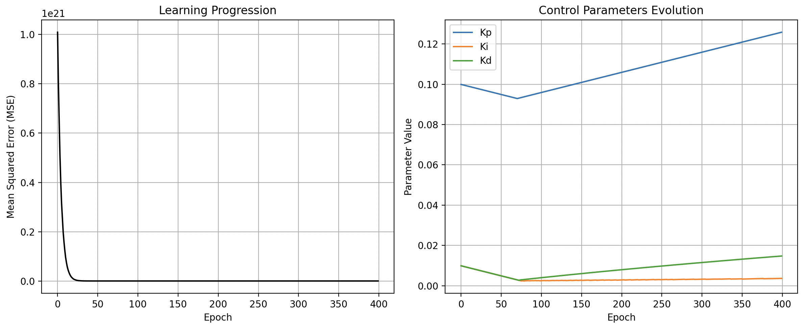

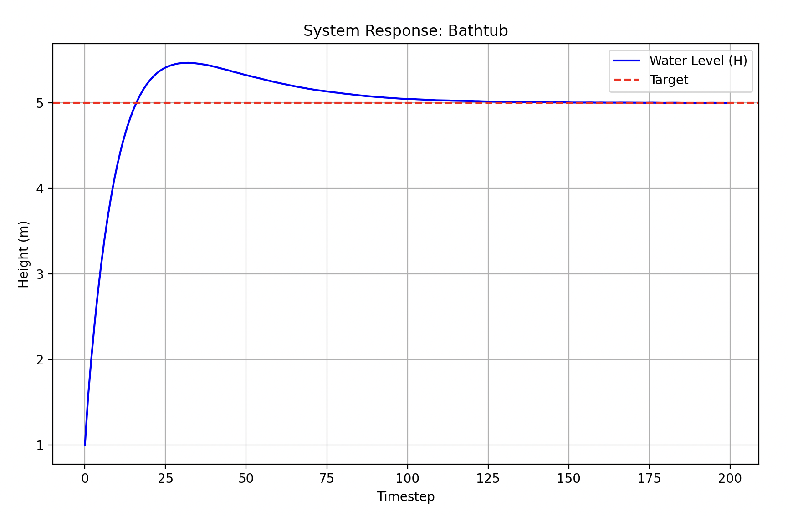


#### Neural-Network-Based Controller

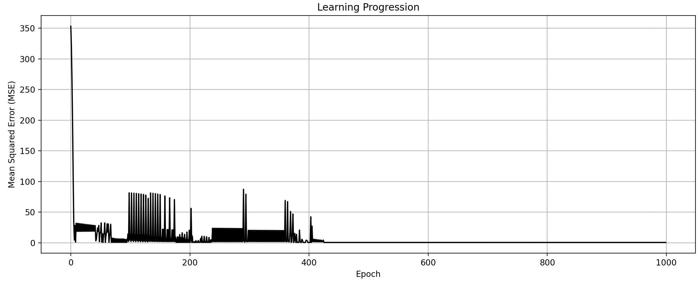

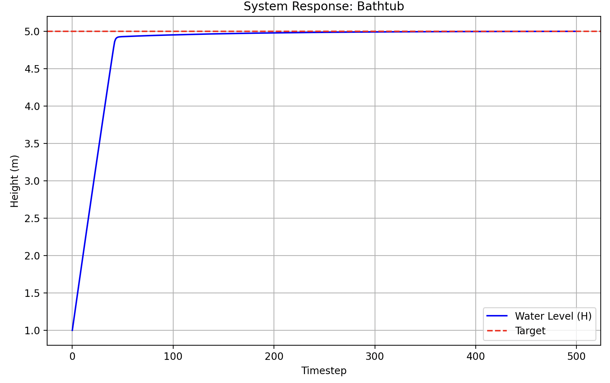


### Cournot Competition

This model simulates an economic market with two rival producers ($q_1$ and $q_2$) competing with a homogeneous product. The market price is determined by the total supply, creating an interactive environment where one producer's output affects the other's profit.

**Market Dynamics**
The market price ($p$) is inversely proportional to the total quantity produced ($q = q_1 + q_2$). Given a maximum possible price ($p_{max}$), the price function is defined as:

$$
p(q) = p_{max} - (q_1 + q_2)
$$

**Production Updates**
The system is controlled from the perspective of Producer 1. The controller output ($U$) determines the change in production level, while Producer 2's output changes based on random market noise ($D$):

$$
q_1(t+1) = q_1(t) + U
$$

$$
q_2(t+1) = q_2(t) + D
$$

**Objective**
The goal is to achieve a specific target profit ($T$). The profit ($P_1$) for the controlled producer is calculated based on their volume ($q_1$) and the marginal cost ($c_m$) to produce each unit:

$$
P_1 = q_1 \cdot (p(q) - c_m)
$$

#### Classic Controller

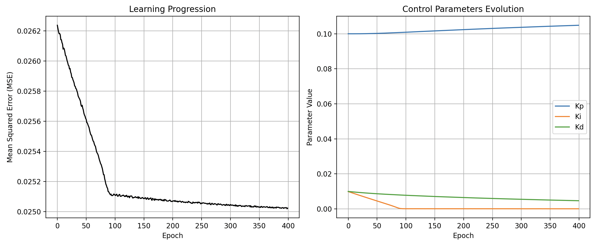


#### Neural-Network-Based Controller

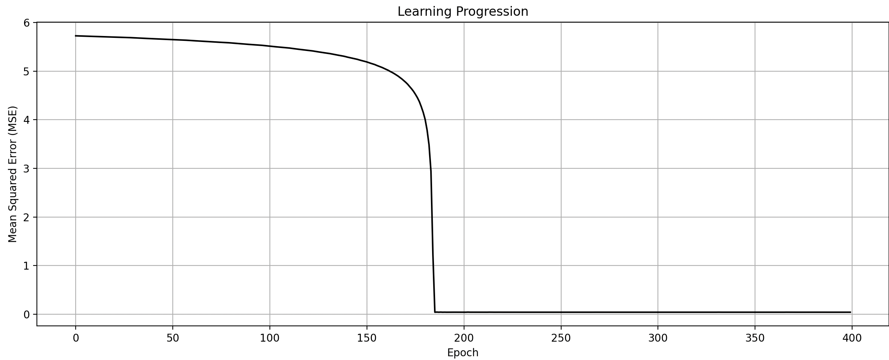

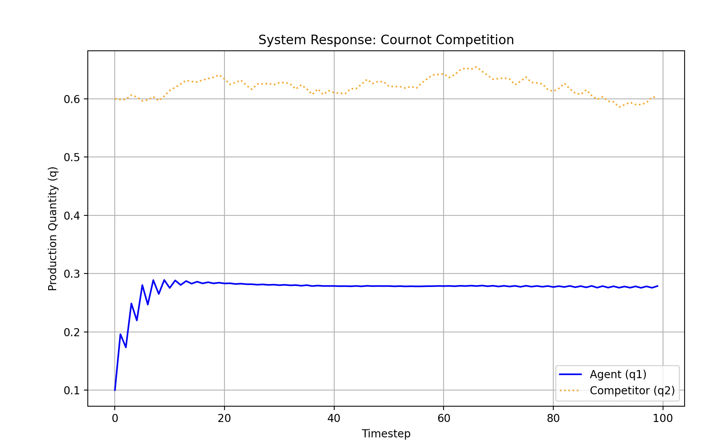


### Drone flight plant

This model simulates the vertical motion of a drone controlled by a single thruster. The system accounts for gravity, wind disturbances, and physical constraints such as ground collision and maximum motor force.

**Force Dynamics**
The drone is acted upon by three main forces: the upward thrust from the motor ($F_{thrust}$), external environmental disturbances ($D$), and the downward force of gravity ($g=9.81 m/s^2$).

The motor output is derived from the controller signal ($U$), scaled by a factor of 100 and clamped to represent physical limits (non-negative force with a maximum capacity of 50.0):

$$
F_{thrust} = \text{clamp}(100 \cdot U, \ 0, \ 50)
$$

The net force ($F_{net}$) acting on the drone is:

$$
F_{net} = F_{thrust} + D - (m \cdot g)
$$

**State Update (Kinematics)**
The system state consists of vertical velocity ($v$) and height ($h$). Using Newton's second law ($a = F/m$) and a timestep ($\Delta t = 0.1s$), the state is updated as follows:

$$
v_{t+1} = v_t + \left( \frac{F_{net}}{m} \right) \cdot \Delta t
$$

$$
h_{t+1} = \max(0, \ h_t + v_{t+1} \cdot \Delta t)
$$

*Note: The model includes a ground collision constraint. If the height drops to 0, the velocity is reset to 0.*

**Objective**
The controller's goal is to adjust the thrust ($U$) to navigate the drone from an initial height ($H_0$) to a specific target altitude ($H_{target}$) and maintain a hover at that position.

#### Classic Controller

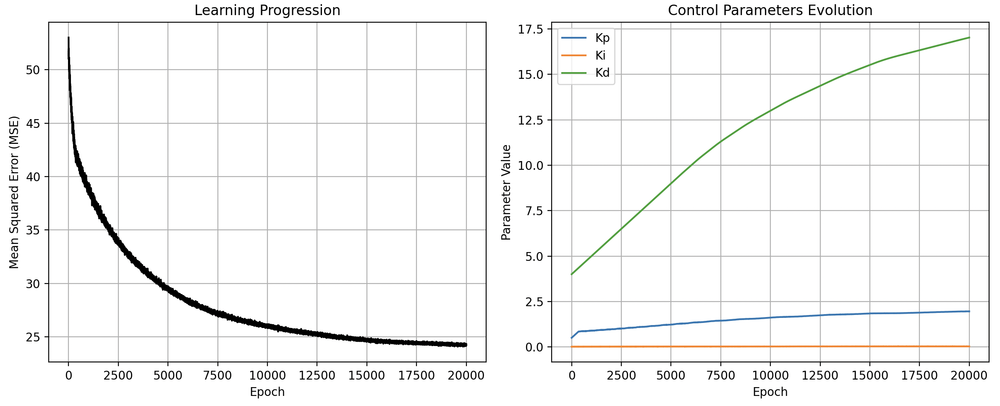

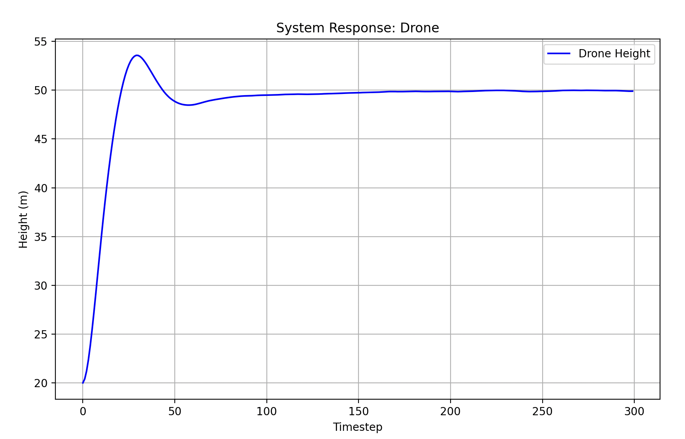

#### Neural-Network-Based Controller

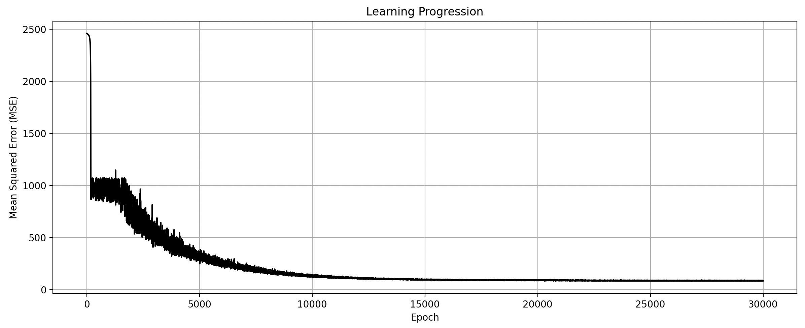

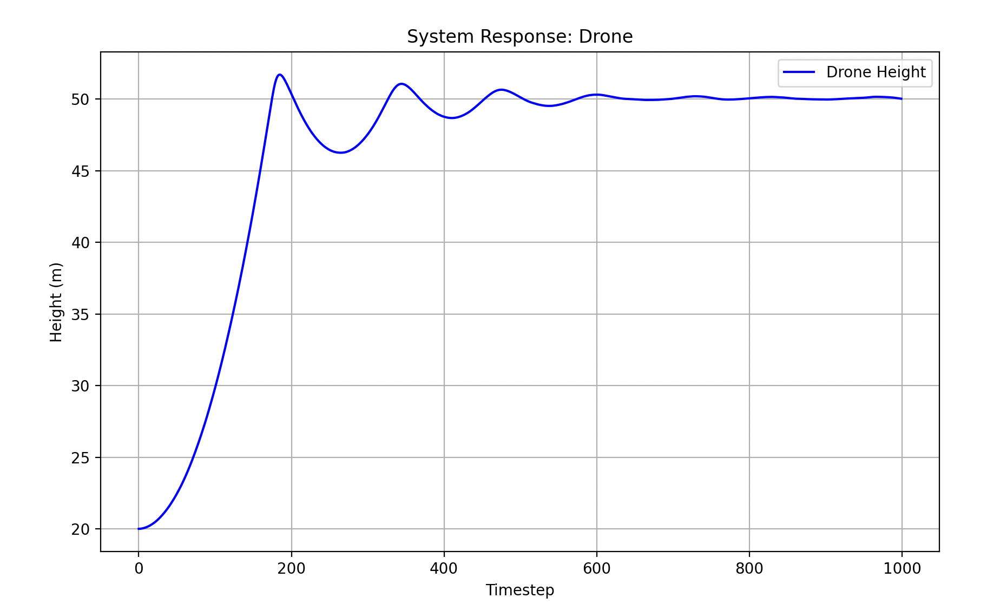

## Conclusions

This project successfully demonstrated the implementation of a general-purpose control system using JAX. By leveraging JAX's `grad` and `scan` capabilities, the system efficiently computed gradients through time, allowing for the optimization of both scalar PID parameters and complex Neural Network weights using the same underlying pipeline.

**Key Takeaways:**

* **Classic PID vs. Neural Network:** The experiments highlight the trade-offs between the two approaches. The **Classic PID** controller proved to be robust and highly interpretable, converging quickly for linear-friendly problems like the Bathtub model. The **Neural Network controller**, while requiring more careful hyperparameter tuning (such as learning rate and initialization), offered greater flexibility. It demonstrated the ability to approximate complex control laws without predefined mathematical structures.
* **The Power of JAX:** Using JAX for automatic differentiation eliminated the need for manual gradient derivations. This made the system highly modular; adding a new plant (like the Drone or Cournot model) required only defining the forward physics, with the optimization logic remaining unchanged.
* **Generalization:** The separation of concerns between the Plant and the Controller proved effective. The same controller code successfully adapted to three distinct physical domains (Fluid Dynamics, Economics, and Kinematics) simply by observing error signals and optimizing based on a universal loss function.